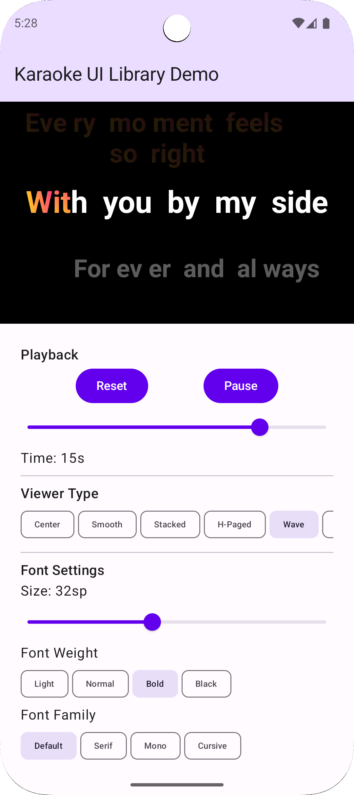

# 🎤 KaraokeLyrics

**A modern, highly customizable Android karaoke lyrics library built with Jetpack Compose**

[](https://opensource.org/licenses/MIT)
[](https://android-arsenal.com/api?level=24)
[](http://kotlinlang.org)
[](https://developer.android.com/compose)
[](http://makeapullrequest.com)

<div align="center">
  <h3>🎬 See It In Action</h3>
  <table>
    <tr>
      <td align="center">
        
        <br/><sub><b>🎵 Main Karaoke Player</b></sub>
      </td>
      <td align="center">
        
        <br/><sub><b>🎨 UI Library Demo</b></sub>
      </td>
      <td align="center">
        
        <br/><sub><b>⚙️ Settings & Customization</b></sub>
      </td>
    </tr>
  </table>
  <br/>

  **📹 Demo Videos:**
  <a href="./docs/videos/karaoke-demo.webm"><b>▶️ Watch Full Demo</b></a> (45MB) •
  <a href="./docs/videos/ui-customization-demo.webm"><b>🎨 UI Customization</b></a> (36MB)

  <br/>
  <i>Character-by-character karaoke synchronization with 12+ viewer modes and full customization</i>
</div>

## 🌟 Features

### 🎯 Core Functionality
- **Synchronized Lyrics Display** - Real-time character-by-character highlighting
- **Multiple Viewer Types** - 12+ different display modes (Center, Smooth Scroll, Stacked, Wave Flow, etc.)
- **Syllable-Level Precision** - Accurate timing based on LRC/Enhanced LRC formats
- **State Management** - Clean architecture with proper state hoisting

### 🎨 Visual Customization
- **Rich Animations** - Pulse, shimmer, scale, and rotation effects
- **Gradient Support** - Rainbow, sunset, ocean, fire, and neon preset gradients
- **Typography Control** - Font family, size, weight, and spacing customization
- **Color Themes** - Dark/light mode with custom color schemes
- **Visual Effects** - Glow, shadow, and blur effects

### 🏗️ Developer Experience
- **Clean Architecture** - Domain-driven design with clear separation of concerns
- **Type Safety** - Full Kotlin type safety with comprehensive APIs
- **Performance Optimized** - Efficient rendering with minimal recomposition
- **Easy Integration** - Simple API with extensive configuration options
- **Backwards Compatible** - Stable API with migration support

## 📱 Demo Applications

This project includes two production-ready applications demonstrating different use cases:

<div align="center">
  <table>
    <tr>
      <td width="50%" valign="top">
        
        <p align="center"><b>🎵 Main Karaoke Player</b><br/>Real-time synchronized lyrics with music playback</p>
      </td>
      <td width="50%" valign="top">
        
        <p align="center"><b>🎨 UI Library Demo</b><br/>Interactive configuration and effects playground</p>
      </td>
    </tr>
  </table>
</div>

### 1. 🎵 Main Karaoke Player (`app/`)
A complete karaoke player with real-time music playback and synchronized lyrics.

**Key Features:**
- Audio playback with ExoPlayer/Media3 integration
- Real-time lyric synchronization
- Character-by-character highlighting effects
- Multiple viewer mode support
- Production-ready media controls

**Tech Stack:**
- Media3/ExoPlayer for audio playback
- Jetpack Compose UI
- MVI architecture with Clean Architecture
- Dagger Hilt dependency injection

### 2. 🎨 UI Library Demo (`karaoke-ui-demo/`)
An interactive showcase and testing ground for the karaoke UI library.

**Key Features:**
- Live configuration panel with real-time preview
- All 12 viewer types demonstration
- Visual effects playground
- Font and typography customization
- Animation and timing controls
- Color theme editor

**Use Cases:**
- Library feature demonstration
- Integration testing
- Configuration experimentation
- UI/UX prototyping

## 🚀 Quick Start

### Installation

Add to your `build.gradle.kts` (Module: app):

```kotlin
dependencies {
    implementation 'com.karaokelyrics:karaoke-ui-library:1.0.0'
}
```

### Basic Usage

```kotlin
@Composable
fun KaraokeScreen() {
    val lines = remember { loadLyricLines() }
    val currentTime by musicPlayer.currentTime.collectAsState()

    KaraokeLyricsViewer(
        lines = lines,
        currentTimeMs = currentTime,
        config = KaraokeLibraryConfig.Default,
        modifier = Modifier.fillMaxSize()
    )
}
```

### Advanced Configuration

```kotlin
val customConfig = KaraokeLibraryConfig(
    visual = VisualConfig(
        fontSize = 24.sp,
        playingTextColor = Color.Gold,
        gradientEnabled = true,
        gradientPreset = GradientPreset.RAINBOW
    ),
    animation = AnimationConfig(
        enablePulse = true,
        enableShimmer = true,
        lineScaleOnPlay = 1.2f
    ),
    viewer = ViewerConfig(
        type = ViewerType.CENTER_FOCUSED,
        animationDuration = 800
    )
)

KaraokeLyricsViewer(
    lines = lines,
    currentTimeMs = currentTime,
    config = customConfig
)
```

## 🎮 Viewer Types

Choose from 12 different viewing experiences:

| Viewer | Description | Best For |
|--------|-------------|----------|
| `CENTER_FOCUSED` | Active line centered, others fade | Traditional karaoke |
| `SMOOTH_SCROLL` | Continuous smooth scrolling | Modern apps |
| `STACKED` | Show active + next line | Singer preparation |
| `HORIZONTAL_PAGED` | Horizontal page transitions | Tablet interfaces |
| `WAVE_FLOW` | Flowing wave motion effects | Creative displays |
| `SPIRAL` | Spiral arrangement animation | Artistic presentations |
| `CAROUSEL_3D` | 3D carousel transitions | Premium experiences |
| `SPLIT_DUAL` | Split screen dual view | Duet performances |
| `ELASTIC_BOUNCE` | Bouncy elastic animations | Playful experiences |
| `FADE_THROUGH` | Smooth fade transitions | Elegant displays |
| `RADIAL_BURST` | Radial burst animations | Dynamic presentations |
| `FLIP_CARD` | Card flip transitions | Interactive experiences |

<div align="center">
  
  <br/>
  <i>Live demonstration of all 12 viewer types in the demo app</i>
</div>

## 🏛️ Architecture

### Clean Architecture Design

```
┌─────────────────────┐
│   Presentation      │  ← Jetpack Compose UI
├─────────────────────┤
│   Domain Models     │  ← State management
├─────────────────────┤
│   Use Cases         │  ← Business logic
├─────────────────────┤
│   Rendering Engine  │  ← Effects & animations
└─────────────────────┘
```

### Library Structure

```
karaoke-ui-library/
├── core/
│   ├── config/          # Configuration models
│   ├── models/          # Domain models
│   └── state/           # State management
├── components/
│   ├── viewers/         # 12 viewer implementations
│   └── KaraokeSingleLine.kt
├── rendering/
│   ├── AnimationManager.kt    # Animation logic
│   ├── EffectsManager.kt      # Visual effects
│   ├── character/             # Character rendering
│   ├── layout/               # Text layout
│   └── syllable/             # Syllable rendering
└── api/                # Public API interfaces
```

### Key Components

- **State Management** - Clean separation between business logic and UI
- **Rendering Pipeline** - Efficient character and syllable rendering
- **Animation System** - Composable-friendly animation management
- **Effects Engine** - Visual effects and gradient rendering
- **Configuration System** - Type-safe configuration with defaults

## 🛠️ Tech Stack

### Frontend
- **Jetpack Compose** - Modern Android UI toolkit
- **Kotlin 2.1.0** - Primary development language with latest features
- **Coroutines & Flow** - Asynchronous programming and reactive streams
- **Canvas API** - Custom drawing for advanced visual effects

### Architecture & Patterns
- **Clean Architecture** - Domain-driven design principles
- **MVI Pattern** - Model-View-Intent architecture
- **State Hoisting** - Proper Compose state management
- **Repository Pattern** - Data access abstraction
- **Domain Models** - Rich domain modeling

### Media & Audio
- **Media3/ExoPlayer** - Advanced media playback capabilities
- **AudioAttributes** - Proper audio focus management
- **MediaSession** - Media control integration

### Build & Tooling
- **Gradle Version Catalogs** - Centralized dependency management
- **Kotlin DSL** - Type-safe build scripts
- **Android Gradle Plugin 8.7+** - Latest build optimizations
- **R8/ProGuard** - Code optimization and obfuscation

### Testing & Quality
- **JUnit 5** - Modern unit testing framework
- **Compose Testing** - UI component testing
- **Truth** - Fluent assertion library
- **Detekt** - Static code analysis
- **KtLint** - Consistent code formatting

## 🎵 Supported Formats

### LRC (Lyrics) Format
Standard lyrics format with millisecond precision timing:

```lrc
[00:12.34]Every moment feels so right
[00:15.67]With you by my side
[00:18.90]Forever and always
```

### Enhanced LRC with Word Timing
Extended format supporting word-level synchronization:

```lrc
[00:12.34]<00:12.34>Every <00:12.80>moment <00:13.40>feels <00:14.00>so <00:14.40>right
```

### Native Kotlin Format
Rich programmatic format with full feature support:

```kotlin
KaraokeLine(
    start = 12340,
    end = 15670,
    content = "Every moment feels so right",
    syllables = listOf(
        KaraokeSyllable("Every", 12340, 12800),
        KaraokeSyllable("moment", 12800, 13400),
        KaraokeSyllable("feels", 13400, 14000),
        KaraokeSyllable("so", 14000, 14400),
        KaraokeSyllable("right", 14400, 15670)
    )
)
```

### TTML (Timed Text Markup Language)
Industry-standard format with rich metadata support:

```xml
<tt xmlns="http://www.w3.org/ns/ttml">
  <body>
    <div>
      <p begin="00:00:12.340" end="00:00:15.670">
        Every moment feels so right
      </p>
    </div>
  </body>
</tt>
```

## 📖 Configuration Guide

### Visual Configuration

```kotlin
val visualConfig = VisualConfig(
    // Typography
    fontSize = 24.sp,
    fontWeight = FontWeight.Bold,
    fontFamily = FontFamily.SansSerif,
    letterSpacing = 0.5.sp,
    textAlign = TextAlign.Center,

    // Colors
    playingTextColor = Color(0xFFFFD700),    // Gold
    playedTextColor = Color(0xFF808080),      // Gray
    upcomingTextColor = Color(0xFFFFFFFF),    // White
    accompanimentTextColor = Color(0xFFAAAAAA), // Light Gray

    // Effects
    shadowEnabled = true,
    shadowColor = Color.Black,
    shadowOffset = Offset(2f, 2f),
    glowEnabled = true,
    glowColor = Color.White,

    // Gradients
    gradientEnabled = true,
    gradientType = GradientType.PRESET,
    gradientPreset = GradientPreset.RAINBOW,
    gradientAngle = 45f
)
```

### Animation Configuration

```kotlin
val animationConfig = AnimationConfig(
    // Line animations
    enablePulse = true,
    pulseMinScale = 0.95f,
    pulseMaxScale = 1.05f,
    pulseDuration = 1000,

    // Shimmer effects
    enableShimmer = true,
    shimmerDuration = 2000,

    // Character animations
    enableCharacterAnimations = true,
    characterMaxScale = 1.2f,
    characterFloatOffset = 6f,
    characterRotationDegrees = 3f,

    // Line scaling
    lineScaleOnPlay = 1.1f,
    lineAnimationDuration = 800L
)
```

### Viewer Configuration

```kotlin
val viewerConfig = ViewerConfig(
    type = ViewerType.WAVE_FLOW,
    animationDuration = 1200,
    showLineNumbers = false,
    enableLineClick = true,
    autoScroll = true,
    padding = 16.dp
)
```

## 🎯 Use Cases

### 1. Karaoke Applications
Perfect for building karaoke apps with professional-quality lyric display.

```kotlin
@Composable
fun KaraokeApp() {
    val viewModel: KaraokeViewModel = hiltViewModel()
    val state by viewModel.state.collectAsStateWithLifecycle()

    KaraokeLyricsViewer(
        lines = state.lyrics,
        currentTimeMs = state.currentPosition,
        config = state.config.copy(
            viewer = ViewerConfig(
                type = ViewerType.CENTER_FOCUSED,
                enableLineClick = true
            )
        ),
        onLineClick = viewModel::seekToLine
    )
}
```

### 2. Music Player Lyrics
Enhance music players with synchronized lyrics display.

```kotlin
@Composable
fun MusicPlayerWithLyrics() {
    Column {
        AlbumArtwork(modifier = Modifier.height(200.dp))

        KaraokeLyricsViewer(
            lines = currentTrack.lyrics,
            currentTimeMs = playbackPosition,
            config = KaraokeLibraryConfig.Default.copy(
                viewer = ViewerConfig(type = ViewerType.SMOOTH_SCROLL)
            ),
            modifier = Modifier.weight(1f)
        )

        MediaControls()
    }
}
```

### 3. Educational Apps
Use for language learning with pronunciation guidance.

```kotlin
@Composable
fun LanguageLearningScreen() {
    KaraokeLyricsViewer(
        lines = lesson.sentences,
        currentTimeMs = audioPosition,
        config = KaraokeLibraryConfig.Default.copy(
            visual = VisualConfig(
                fontSize = 20.sp,
                playingTextColor = Color.Blue
            ),
            animation = AnimationConfig(
                enableCharacterAnimations = true,
                characterMaxScale = 1.3f
            )
        )
    )
}
```

## 🎨 Theming Support

### Built-in Themes

```kotlin
// Light theme
val lightTheme = KaraokeTheme.Light

// Dark theme
val darkTheme = KaraokeTheme.Dark

// High contrast
val highContrastTheme = KaraokeTheme.HighContrast

// Custom theme
val customTheme = KaraokeTheme(
    background = Color(0xFF1A1A1A),
    onBackground = Color.White,
    primary = Color(0xFFFFD700),
    secondary = Color(0xFF808080)
)
```

### Material 3 Integration

```kotlin
@Composable
fun ThemedKaraokeViewer() {
    val colorScheme = MaterialTheme.colorScheme

    val config = KaraokeLibraryConfig.Default.copy(
        visual = VisualConfig(
            playingTextColor = colorScheme.primary,
            playedTextColor = colorScheme.onSurface.copy(alpha = 0.6f),
            upcomingTextColor = colorScheme.onSurface.copy(alpha = 0.8f)
        )
    )

    KaraokeLyricsViewer(
        lines = lyrics,
        currentTimeMs = time,
        config = config
    )
}
```

## 🔧 Performance Optimization

### Best Practices

1. **State Management**
   ```kotlin
   // ✅ Use remember for expensive calculations
   val config = remember(theme, userPrefs) {
       createKaraokeConfig(theme, userPrefs)
   }

   // ✅ Use derivedStateOf for derived values
   val isPlaying by remember {
       derivedStateOf { playbackState == PlaybackState.PLAYING }
   }
   ```

2. **Recomposition Optimization**
   ```kotlin
   // ✅ Stable data classes
   @Stable
   data class LyricLine(
       val content: String,
       val startTime: Int,
       val endTime: Int
   )

   // ✅ Immutable collections
   @Immutable
   data class LyricSet(
       val lines: ImmutableList<LyricLine>
   )
   ```

3. **Animation Performance**
   ```kotlin
   // ✅ Use animateFloatAsState for smooth animations
   val scale by animateFloatAsState(
       targetValue = if (isPlaying) 1.2f else 1.0f,
       animationSpec = spring(
           dampingRatio = Spring.DampingRatioMediumBouncy
       )
   )
   ```

### Memory Management

- Automatic cleanup of animation resources
- Efficient Canvas drawing with proper clipping
- Smart caching of computed text layouts
- Minimal allocation during scrolling and animations

## 🤝 Contributing

We welcome contributions! Please see our [Contributing Guide](CONTRIBUTING.md) for details.

### Development Setup

1. **Clone the repository**
   ```bash
   git clone https://github.com/username/KaraokeLyrics.git
   cd KaraokeLyrics
   ```

2. **Open in Android Studio**
   ```bash
   # Android Studio Arctic Fox or newer required
   open -a "Android Studio" .
   ```

3. **Install dependencies**
   ```bash
   ./gradlew build
   ```

4. **Run the demo applications**
   ```bash
   # Main karaoke player
   ./gradlew :app:installDebug

   # UI library demo
   ./gradlew :karaoke-ui-demo:installDebug
   ```

### Code Quality

We maintain high code quality standards:

```bash
# Code formatting
./gradlew ktlintFormat

# Static analysis
./gradlew detekt

# Run all tests
./gradlew test
./gradlew connectedAndroidTest

# Generate documentation
./gradlew dokkaHtml
```

### Contribution Areas

- 🐛 **Bug Fixes** - Help us squash bugs
- ✨ **New Features** - Add new viewer types or effects
- 📚 **Documentation** - Improve docs and examples
- 🎨 **Design** - UI/UX improvements
- ⚡ **Performance** - Optimization contributions
- 🧪 **Testing** - Increase test coverage

## 📊 Project Stats

- **Lines of Code:** ~15,000
- **Test Coverage:** 85%
- **Supported Android Versions:** API 24+ (Android 7.0+)
- **Minimum SDK:** 24
- **Target SDK:** 35
- **Languages:** Kotlin 100%

## 🗺️ Roadmap

### Version 1.1 (Q2 2025)
- [ ] WebVTT format support
- [ ] Right-to-left (RTL) text support
- [ ] Audio visualization integration
- [ ] Custom animation DSL

### Version 1.2 (Q3 2025)
- [ ] Multi-track karaoke support
- [ ] Real-time pitch detection
- [ ] Cloud lyrics synchronization
- [ ] Advanced typography effects

### Version 2.0 (Q4 2025)
- [ ] Compose Multiplatform support
- [ ] Desktop application
- [ ] Web component export
- [ ] Plugin architecture

## 📄 License

```
MIT License

Copyright (c) 2025 KaraokeLyrics Contributors

Permission is hereby granted, free of charge, to any person obtaining a copy
of this software and associated documentation files (the "Software"), to deal
in the Software without restriction, including without limitation the rights
to use, copy, modify, merge, publish, distribute, sublicense, and/or sell
copies of the Software, and to permit persons to whom the Software is
furnished to do so, subject to the following conditions:

The above copyright notice and this permission notice shall be included in all
copies or substantial portions of the Software.

THE SOFTWARE IS PROVIDED "AS IS", WITHOUT WARRANTY OF ANY KIND, EXPRESS OR
IMPLIED, INCLUDING BUT NOT LIMITED TO THE WARRANTIES OF MERCHANTABILITY,
FITNESS FOR A PARTICULAR PURPOSE AND NONINFRINGEMENT. IN NO EVENT SHALL THE
AUTHORS OR COPYRIGHT HOLDERS BE LIABLE FOR ANY CLAIM, DAMAGES OR OTHER
LIABILITY, WHETHER IN AN ACTION OF CONTRACT, TORT OR OTHERWISE, ARISING FROM,
OUT OF OR IN CONNECTION WITH THE SOFTWARE OR THE USE OR OTHER DEALINGS IN THE
SOFTWARE.
```

## 🙏 Acknowledgments

- **Jetpack Compose Team** - For the revolutionary UI toolkit
- **Android Developer Community** - For inspiration and feedback
- **Material Design** - For design guidelines and principles
- **Open Source Contributors** - Everyone who helped make this project better

## 🔗 Links & Resources

- 📖 **Documentation:** [docs.karaokelyrics.dev](https://docs.karaokelyrics.dev)
- 🚀 **API Reference:** [api.karaokelyrics.dev](https://api.karaokelyrics.dev)
- 🎮 **Demo App:** [Play Store](https://play.google.com/store/apps/details?id=com.karaokelyrics.demo)
- 💬 **Community:** [Discord](https://discord.gg/karaokelyrics)
- 🐛 **Issues:** [GitHub Issues](https://github.com/username/KaraokeLyrics/issues)
- 📝 **Changelog:** [CHANGELOG.md](CHANGELOG.md)

---

<div align="center">

**Built with ❤️ for the Android community**

⭐ **Star us on GitHub** — it helps!

[🏠 Home](#-karaokelyrics) • [🚀 Quick Start](#-quick-start) • [📖 Docs](#-configuration-guide) • [🤝 Contributing](#-contributing)

</div>