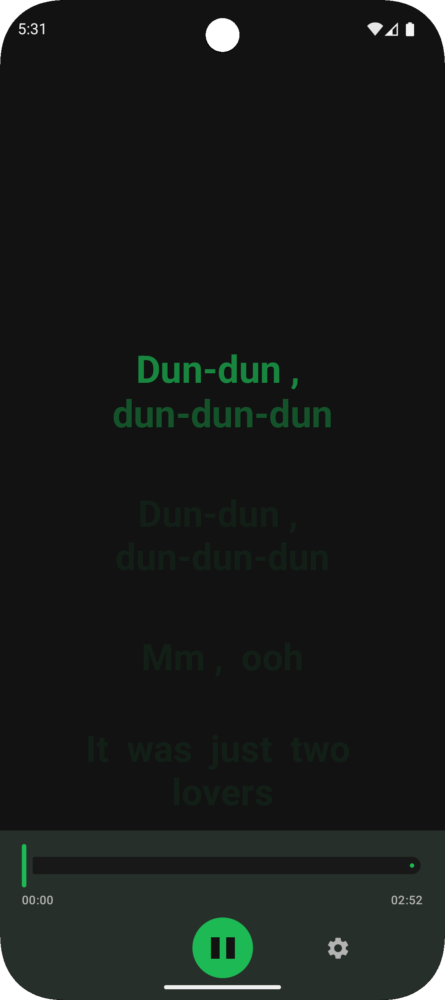
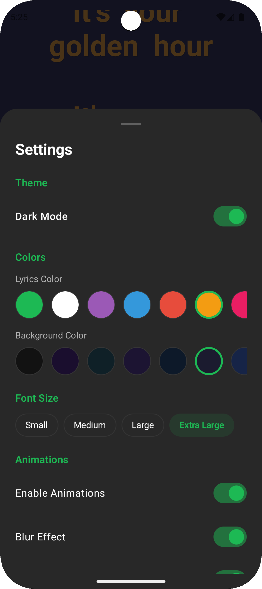

# KaraokeLyrics

**A sample Android application demonstrating the [Kyrics](https://github.com/lchau1017/Kyrics) library - a modern, highly customizable karaoke lyrics library built with Jetpack Compose**

[](https://opensource.org/licenses/MIT)
[](https://android-arsenal.com/api?level=31)
[](http://kotlinlang.org)
[](https://developer.android.com/compose)
[](https://jitpack.io/#lchau1017/Kyrics)

<div align="center">
  <h3>See It In Action</h3>
  <table>
    <tr>
      <td align="center">
        
        <br/><sub><b>Main Karaoke Player</b></sub>
      </td>
      <td align="center">
        
        <br/><sub><b>Kyrics Library Demo</b></sub>
      </td>
      <td align="center">
        
        <br/><sub><b>Settings & Customization</b></sub>
      </td>
    </tr>
  </table>
  <br/>

  **Demo Videos:**
  <a href="./docs/videos/karaoke-demo.webm"><b>Watch Full Demo</b></a> (45MB) |
  <a href="./docs/videos/kyrics-demo.webm"><b>Kyrics Library Demo</b></a> (19MB)

  <br/>
  <i>Character-by-character karaoke synchronization with 12+ viewer modes and full customization</i>
</div>

## About the Kyrics Library

[Kyrics](https://github.com/lchau1017/Kyrics) is a powerful Android library for displaying synchronized karaoke lyrics with rich visual effects. This sample application demonstrates how to integrate and use the library in your projects.

### Key Features

- **Synchronized Lyrics Display** - Real-time character-by-character highlighting
- **Multiple Viewer Types** - 12+ different display modes (Stacked, Wave, Spiral, 3D-Carousel, etc.)
- **Rich Customization** - Font settings, animations, gradients, and visual effects
- **Built-in Presets** - 10 ready-to-use theme presets (Neon, Rainbow, Fire, Ocean, etc.)
- **Clean Architecture** - Easy integration with any Android project
- **Performance Optimized** - Efficient rendering with minimal recomposition

## Installation

### Step 1: Add JitPack Repository

In your `settings.gradle.kts` (root level):

```kotlin
dependencyResolutionManagement {
    repositories {
        google()
        mavenCentral()
        maven { url = uri("https://jitpack.io") }
    }
}
```

### Step 2: Add the Kyrics Dependency

In your `app/build.gradle.kts`:

```kotlin
dependencies {
    implementation("com.github.lchau1017:Kyrics:v1.0.0")
}
```

Or using Version Catalog (`gradle/libs.versions.toml`):

```toml
[versions]
kyrics = "v1.0.0"

[libraries]
kyrics = { group = "com.github.lchau1017", name = "Kyrics", version.ref = "kyrics" }
```

Then in your `build.gradle.kts`:

```kotlin
dependencies {
    implementation(libs.kyrics)
}
```

## Basic Usage

```kotlin
import com.kyrics.KyricsViewer
import com.kyrics.config.KyricsConfig

@Composable
fun KaraokeScreen() {
    val lines = remember { loadLyricLines() }
    val currentTime by musicPlayer.currentTime.collectAsState()

    KyricsViewer(
        lines = lines,
        currentTimeMs = currentTime,
        config = KyricsConfig.Default,
        modifier = Modifier.fillMaxSize()
    )
}
```

## Advanced Configuration

```kotlin
import com.kyrics.KyricsViewer
import com.kyrics.KyricsPresets
import com.kyrics.config.KyricsConfig

// Use a built-in preset
val presetConfig = KyricsPresets.Neon

// Or create a fully custom config
val customConfig = KyricsConfig(
    visual = VisualConfig(
        fontSize = 36.sp,
        playingTextColor = Color(0xFFFFD700),
        gradientEnabled = true,
        gradientType = GradientType.LINEAR,
        colors = ColorConfig(
            sung = Color.Magenta,
            unsung = Color.Cyan,
            active = Color.Yellow
        )
    ),
    animation = AnimationConfig(
        enableCharacterAnimations = true,
        characterMaxScale = 1.2f,
        enableLineAnimations = true,
        lineScaleOnPlay = 1.1f
    ),
    layout = LayoutConfig(
        viewerConfig = ViewerConfig(
            type = ViewerType.WAVE_FLOW,
            scrollPosition = 0.5f
        )
    ),
    effects = EffectsConfig(
        enableBlur = true,
        blurIntensity = 0.8f
    )
)

KyricsViewer(
    lines = lines,
    currentTimeMs = currentTime,
    config = customConfig
)
```

## Viewer Types

Choose from 12+ different viewing experiences:

| Viewer | Description | Best For |
|--------|-------------|----------|
| `CENTER_FOCUSED` | Active line centered, others fade | Traditional karaoke |
| `SMOOTH_SCROLL` | Continuous smooth scrolling | Modern apps |
| `STACKED` | Show active + next line | Singer preparation |
| `HORIZONTAL_PAGED` | Horizontal page transitions | Tablet interfaces |
| `WAVE_FLOW` | Flowing wave motion effects | Creative displays |
| `SPIRAL` | Spiral arrangement animation | Artistic presentations |
| `CAROUSEL_3D` | 3D carousel transitions | Premium experiences |
| `SPLIT_DUAL` | Split screen dual view | Duet performances |
| `ELASTIC_BOUNCE` | Bouncy elastic animations | Playful experiences |
| `FADE_THROUGH` | Smooth fade transitions | Elegant displays |
| `RADIAL_BURST` | Radial burst animations | Dynamic presentations |
| `FLIP_CARD` | Card flip transitions | Interactive experiences |

## Built-in Presets

The Kyrics library includes 10 ready-to-use theme presets:

```kotlin
import com.kyrics.KyricsPresets

KyricsPresets.Classic   // Simple, clean karaoke style
KyricsPresets.Neon      // Cyan/magenta with gradient effects
KyricsPresets.Rainbow   // Multi-color rainbow gradient
KyricsPresets.Fire      // Warm orange/red colors
KyricsPresets.Ocean     // Cool blue/turquoise
KyricsPresets.Retro     // 80s style with pink/cyan
KyricsPresets.Minimal   // Clean black/gray on white
KyricsPresets.Elegant   // Gold/silver with subtle effects
KyricsPresets.Party     // All effects maxed out
KyricsPresets.Matrix    // Green monospace on black
```

## Sample Applications

This project includes demo applications showcasing the Kyrics library:

### Main Karaoke Player (`app/`)

A complete karaoke player with real-time music playback and synchronized lyrics.

**Features:**
- Audio playback with Media3/ExoPlayer
- Real-time lyric synchronization
- Character-by-character highlighting
- Multiple viewer modes
- Customizable settings

**Tech Stack:**
- Jetpack Compose UI
- Media3/ExoPlayer for audio
- Dagger Hilt dependency injection
- MVI architecture

## Project Structure

```
KaraokeLyrics/
├── app/                    # Sample application
│   ├── presentation/       # UI layer with Compose
│   ├── domain/             # Business logic
│   └── data/               # Data layer
├── gradle/
│   └── libs.versions.toml  # Version catalog
└── docs/                   # Documentation and media
    ├── images/             # Screenshots
    └── videos/             # Demo videos
```

## Running the Sample App

1. Clone the repository:
   ```bash
   git clone https://github.com/lchau1017/KaraokeLyrics.git
   cd KaraokeLyrics
   ```

2. Open in Android Studio

3. Run the app:
   ```bash
   ./gradlew :app:installDebug
   ```

## Code Quality

```bash
# Code formatting check
./gradlew ktlintCheck

# Static analysis
./gradlew detekt

# Run unit tests
./gradlew test
```

## Tech Stack

- **Jetpack Compose** - Modern Android UI toolkit
- **Kotlin 2.1.0** - Primary development language
- **Kyrics Library** - Karaoke lyrics display (via JitPack)
- **Media3/ExoPlayer** - Audio playback
- **Dagger Hilt** - Dependency injection
- **Coroutines & Flow** - Asynchronous programming

## Requirements

- Android API 31+ (Android 12+)
- Kotlin 2.1.0+
- Jetpack Compose 2024.12.01+

## Links

- **Kyrics Library:** [github.com/lchau1017/Kyrics](https://github.com/lchau1017/Kyrics)
- **JitPack:** [jitpack.io/#lchau1017/Kyrics](https://jitpack.io/#lchau1017/Kyrics)

## License

```
MIT License

Copyright (c) 2025 KaraokeLyrics Contributors

Permission is hereby granted, free of charge, to any person obtaining a copy
of this software and associated documentation files (the "Software"), to deal
in the Software without restriction, including without limitation the rights
to use, copy, modify, merge, publish, distribute, sublicense, and/or sell
copies of the Software, and to permit persons to whom the Software is
furnished to do so, subject to the following conditions:

The above copyright notice and this permission notice shall be included in all
copies or substantial portions of the Software.

THE SOFTWARE IS PROVIDED "AS IS", WITHOUT WARRANTY OF ANY KIND, EXPRESS OR
IMPLIED, INCLUDING BUT NOT LIMITED TO THE WARRANTIES OF MERCHANTABILITY,
FITNESS FOR A PARTICULAR PURPOSE AND NONINFRINGEMENT. IN NO EVENT SHALL THE
AUTHORS OR COPYRIGHT HOLDERS BE LIABLE FOR ANY CLAIM, DAMAGES OR OTHER
LIABILITY, WHETHER IN AN ACTION OF CONTRACT, TORT OR OTHERWISE, ARISING FROM,
OUT OF OR IN CONNECTION WITH THE SOFTWARE OR THE USE OR OTHER DEALINGS IN THE
SOFTWARE.
```

---

<div align="center">

**Built with the [Kyrics](https://github.com/lchau1017/Kyrics) library**

</div>
